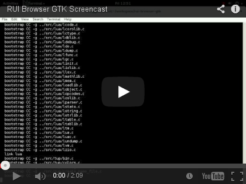

# RUI Browser

This is a web browser with RUI discovery built-in. Use the "Esc" key to return to the discovery page. F11 toggles fullscreen.

## Get Source

    git clone https://github.com/cablelabs/rui-browser-gtk.git --recursive
    cd rui-browser-gtk

## Build

    ./build.sh

While developing, it can be useful to leave `tup` running in the background, autocompiling every time anything changes:

    tup monitor -a
    # stop with 'tup stop'

There is also a `clean.sh` script if you need it, but tup should usually handle that for you.

## Running

    src/browser --static-dir static

Run with `--fullscreen` to start fullscreen, or use F11 to toggle it while running. Use `--help` for other options.

## Using WebKitGTK+ From Git

I haven't found a way to do this without installing WebKit. Do a **release** build of WebKit, then go into the build directory and run either `make install`, `ninja install` or `ninja-build install` (depending on if ninja is installed). For some reason this won't work with debug builds.

    cd ~/workspace/webkit
    # add gst-git to the next command if necessary
    Tools/Scripts/build-webkit --gtk
    cd WebKitBuild/Release

    # You only need to run one of these, but running all of them probably won't
    # hurt anything.
    sudo make install
    sudo ninja install
    sudo ninja-build install

This will install libwebkit2gtk-3.0 in /usr/local/lib or /usr/local/lib64.

To use these with `pkg-config`, add the pkgconfig directory to your `PKG_CONFIG_PATH`:

    export PKG_CONFIG_PATH="/usr/local/lib:$PKG_CONFIG_PATH:/usr/local/lib64:$PKG_CONFIG_PATH"

    # or add it to your bashrc:
    echo 'export PKG_CONFIG_PATH="/usr/local/lib:$PKG_CONFIG_PATH:/usr/local/lib64:$PKG_CONFIG_PATH"' >> ~/.bashrc

Then either add those folders to /etc/ld.so.conf, or to your `LD_LIBRARY_PATH`:

    echo 'export LD_LIBRARY_PATH="/usr/local/lib64:/usr/local/lib:$LD_LIBRARY_PATH"' >> ~/.bashrc

If you're using `gst-git`, do it like this:

    LD_LIBRARY_PATH=/usr/local/lib64:/usr/local/lib gst-git ./src/browser -s static
